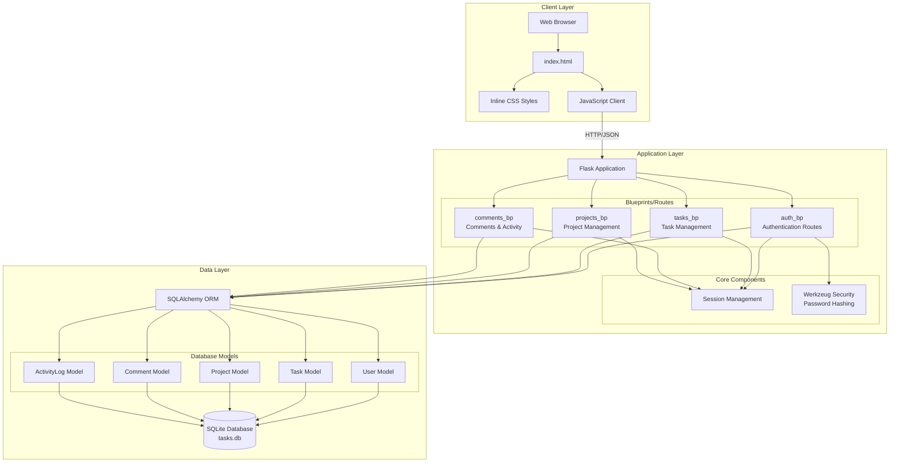
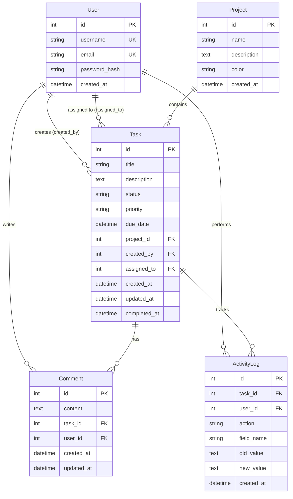
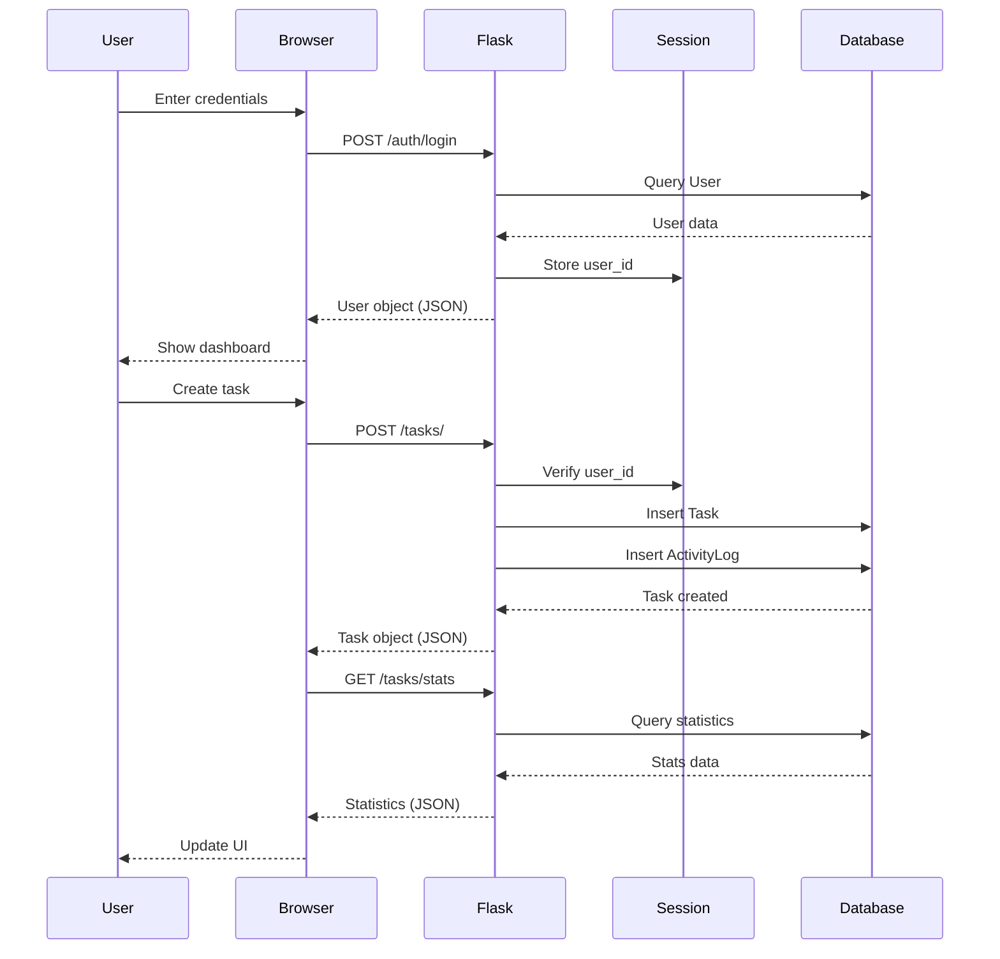
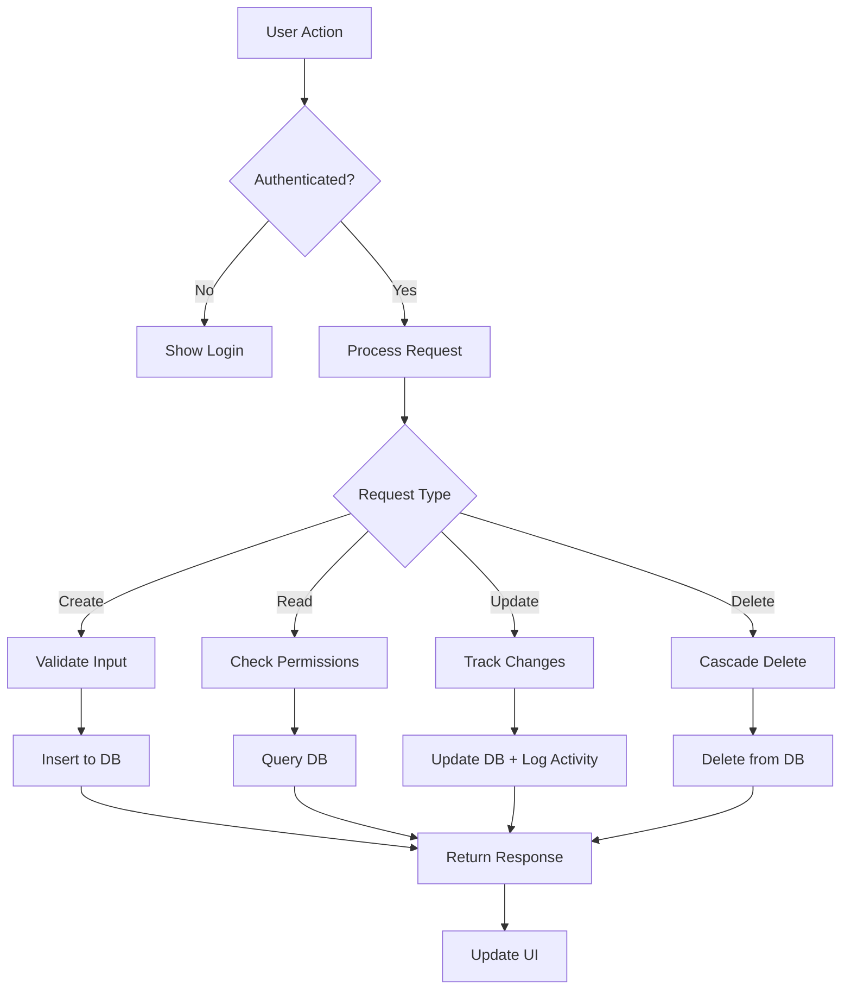
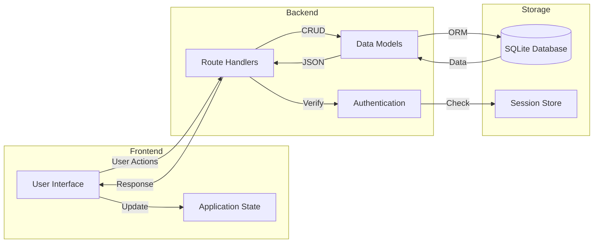
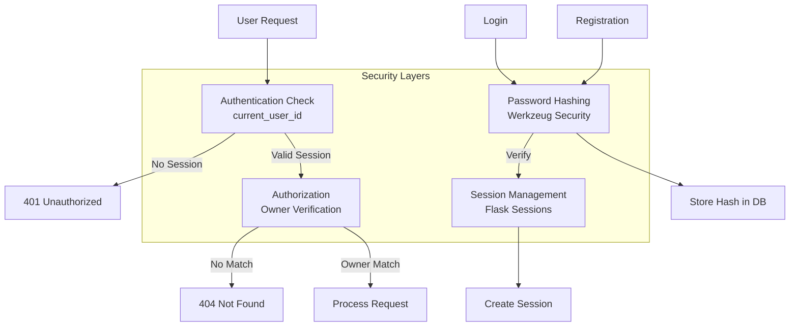

# Task Manager - Architecture Documentation

## System Architecture Overview



## Database Schema



## API Endpoints Architecture

### Authentication Endpoints (`/auth`)
- `POST /auth/register` - Register new user
- `POST /auth/login` - User login
- `POST /auth/logout` - User logout
- `GET /auth/me` - Get current user info

### Task Endpoints (`/tasks`)
- `GET /tasks/` - List all tasks (with filters)
- `POST /tasks/` - Create new task
- `GET /tasks/:id` - Get specific task
- `PUT /tasks/:id` - Update task
- `DELETE /tasks/:id` - Delete task
- `GET /tasks/stats` - Get task statistics

### Project Endpoints (`/projects`)
- `GET /projects/` - List all projects
- `POST /projects/` - Create new project
- `GET /projects/:id` - Get specific project
- `PUT /projects/:id` - Update project
- `DELETE /projects/:id` - Delete project

### Comment & Activity Endpoints (`/api`)
- `GET /api/task/:id/comments` - Get task comments
- `POST /api/task/:id/comments` - Add comment
- `PUT /api/comments/:id` - Update comment
- `DELETE /api/comments/:id` - Delete comment
- `GET /api/task/:id/activity` - Get task activity log

## Request/Response Flow



## Component Interaction Flow



## Data Flow Architecture



## Security Architecture



## File Structure

```
task-manager/
├── app/
│   ├── __init__.py          # Flask app factory
│   ├── database.py          # SQLAlchemy setup
│   ├── models.py            # Database models
│   └── routes/
│       ├── __init__.py
│       ├── auth.py          # Authentication routes
│       ├── tasks.py         # Task management routes
│       ├── projects.py      # Project management routes
│       └── comments.py      # Comments & activity routes
├── static/
│   └── index.html           # Frontend SPA
├── requirements.txt         # Python dependencies
├── run.py                   # Application entry point
└── README.md
```

## Technology Stack

### Backend
- **Framework**: Flask 3.0.0
- **ORM**: Flask-SQLAlchemy 3.1.1
- **Database**: SQLite
- **Security**: Werkzeug 3.0.1
- **Testing**: pytest 8.0.0

### Frontend
- **HTML5**: Structure
- **CSS3**: Styling (inline)
- **JavaScript**: Client-side logic (vanilla)
- **Fetch API**: HTTP requests

## Key Design Patterns

### 1. **Blueprint Pattern**
- Modular route organization
- Separation of concerns
- Easy to maintain and extend

### 2. **Repository Pattern**
- SQLAlchemy ORM abstracts database operations
- Models encapsulate data logic

### 3. **Session-Based Authentication**
- Stateful authentication
- Server-side session storage
- Secure user identification

### 4. **Activity Logging Pattern**
- Audit trail for all changes
- Tracks who, what, when
- Useful for debugging and compliance

### 5. **RESTful API Design**
- Standard HTTP methods
- Resource-based URLs
- JSON request/response

## Scalability Considerations

### Current Limitations
- SQLite (single-file database)
- Session-based auth (not distributed)
- No caching layer
- Synchronous request handling

### Future Improvements
1. **Database**: Migrate to PostgreSQL/MySQL
2. **Authentication**: JWT tokens for stateless auth
3. **Caching**: Redis for session and data caching
4. **API**: Rate limiting and pagination
5. **Frontend**: React/Vue for better state management
6. **Deployment**: Docker containerization
7. **Monitoring**: Logging and error tracking
8. **Testing**: Comprehensive test coverage

## Performance Optimization

### Database
- Indexes on foreign keys
- Eager loading for relationships
- Query optimization

### API
- Pagination for list endpoints
- Field filtering
- Compression

### Frontend
- Lazy loading
- Debouncing user input
- Local state caching

---

**Last Updated**: 2026-05-13  
**Version**: 1.0
