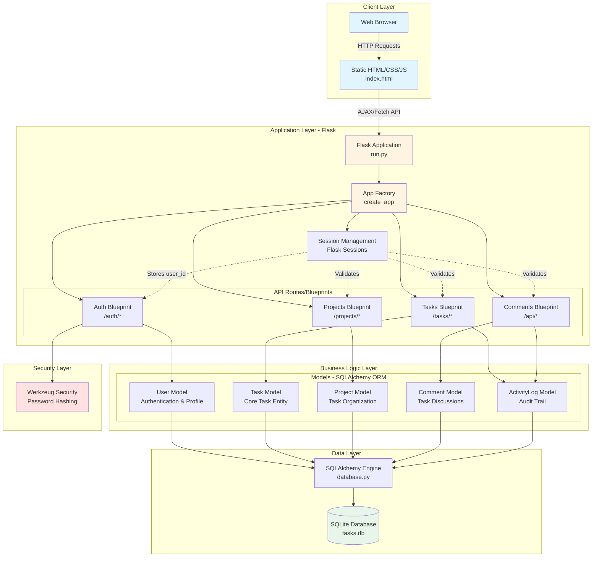
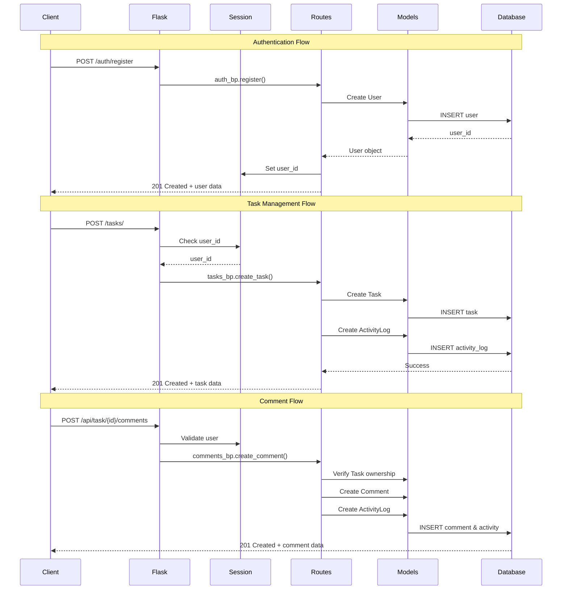
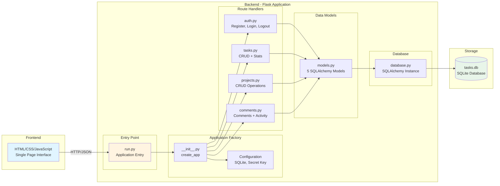
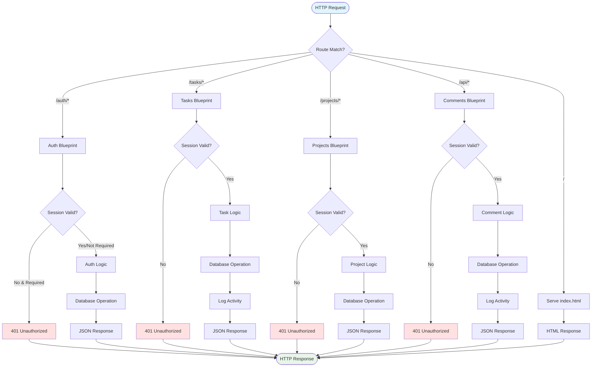
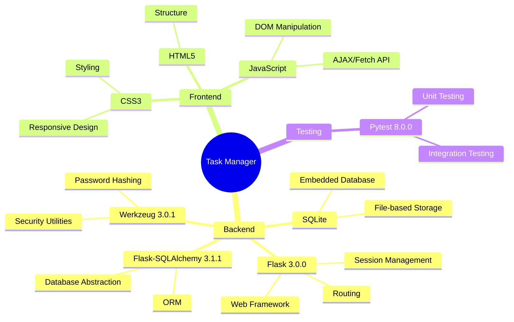
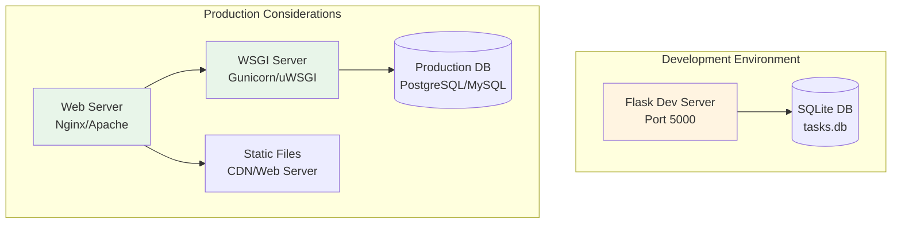

# Task Manager Application - Architecture Diagram

## System Architecture Overview

## Data Model Relationships

## API Endpoints Flow

## Component Architecture

## Request/Response Flow

## Technology Stack

## Key Features & Capabilities

### Authentication & Authorization
- User registration with email validation
- Secure password hashing (Werkzeug)
- Session-based authentication
- User profile management

### Task Management
- CRUD operations for tasks
- Task status tracking (todo, in_progress, done)
- Priority levels (low, medium, high, urgent)
- Due date management with overdue detection
- Task assignment to users
- Task filtering and search

### Project Organization
- Project creation and management
- Color-coded projects
- Task grouping by project
- Project-level statistics

### Collaboration Features
- Comments on tasks
- Activity logging for audit trail
- User mentions and notifications (via activity log)

### Analytics & Reporting
- Task statistics by status
- Task statistics by priority
- Completion rate calculation
- Overdue task tracking

## Security Considerations

1. **Password Security**: Werkzeug password hashing
2. **Session Management**: Flask secure sessions with secret key
3. **Authentication**: Session-based user validation on protected routes
4. **Data Isolation**: Users can only access their own tasks
5. **Input Validation**: Request data validation in route handlers

## Deployment Architecture

