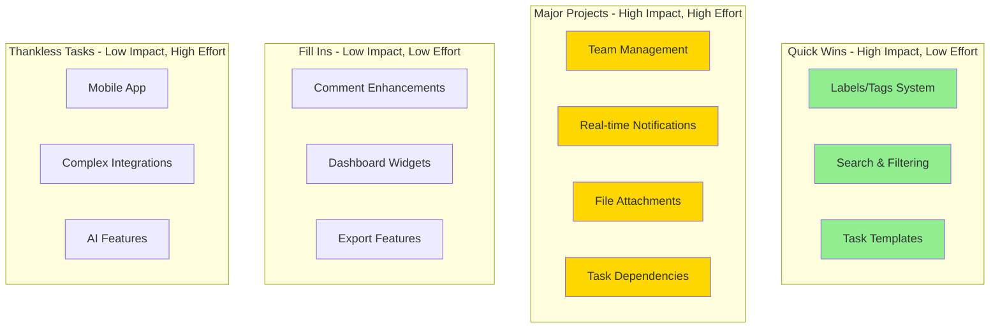

# Task Manager - Feature Roadmap & Enhancement Suggestions

Based on the current architecture analysis, here are recommended features that would enhance the application:

## 🎯 High Priority Features

### 1. Real-time Notifications System
**Why:** Users need immediate awareness of task updates, assignments, and comments
- WebSocket integration for real-time updates
- In-app notification center
- Email notifications for critical events
- Browser push notifications
- Notification preferences per user

**Technical Implementation:**
- Add Flask-SocketIO for WebSocket support
- Create Notification model with read/unread status
- Add notification preferences to User model
- Implement email service (Flask-Mail)

### 2. Team & Workspace Management
**Why:** Current system lacks multi-user collaboration structure
- Create Workspace/Team model
- Team member roles (Owner, Admin, Member, Viewer)
- Invite system with email invitations
- Team-level permissions and access control
- Shared projects across team members

**Database Changes:**
```
Workspace Model:
- id, name, description, created_by, created_at

WorkspaceMember Model:
- id, workspace_id, user_id, role, joined_at

Project.workspace_id (FK to Workspace)
```

### 3. File Attachments
**Why:** Tasks often require supporting documents, images, or files
- Upload files to tasks and comments
- Support for images, PDFs, documents
- File preview functionality
- Cloud storage integration (AWS S3, Azure Blob)
- File size limits and type validation

**Technical Implementation:**
- Add Attachment model (file_path, file_type, size, task_id, comment_id)
- Implement file upload endpoint
- Add storage service abstraction layer
- Implement file cleanup on task/comment deletion

### 4. Advanced Search & Filtering
**Why:** As tasks grow, finding specific items becomes difficult
- Full-text search across tasks, comments, projects
- Advanced filters (date ranges, multiple statuses, tags)
- Saved search queries
- Search history
- Elasticsearch integration for better performance

**Technical Implementation:**
- Add search endpoint with query parameters
- Implement SQLAlchemy full-text search or Elasticsearch
- Create SavedSearch model
- Add search indexing for better performance

### 5. Task Dependencies & Subtasks
**Why:** Complex tasks need breakdown and sequencing
- Parent-child task relationships
- Task dependencies (blocked by, blocks)
- Subtask progress tracking
- Gantt chart view for dependencies
- Critical path calculation

**Database Changes:**
```
TaskDependency Model:
- id, task_id, depends_on_task_id, dependency_type

Task.parent_task_id (FK to Task for subtasks)
```

## 🚀 Medium Priority Features

### 6. Time Tracking & Estimates
**Why:** Project management requires time awareness
- Time estimates for tasks
- Actual time tracking (start/stop timer)
- Time logs per task
- Burndown charts
- Time reports by user/project

**Technical Implementation:**
- Add TimeLog model (task_id, user_id, start_time, end_time, duration)
- Add estimated_hours, actual_hours to Task model
- Create time tracking API endpoints
- Add timer functionality in frontend

### 7. Custom Fields & Task Templates
**Why:** Different teams need different task attributes
- Custom field definitions per workspace
- Field types (text, number, date, dropdown, checkbox)
- Task templates for recurring task types
- Template library
- Quick task creation from templates

**Database Changes:**
```
CustomField Model:
- id, workspace_id, name, field_type, options, required

TaskFieldValue Model:
- id, task_id, custom_field_id, value

TaskTemplate Model:
- id, workspace_id, name, default_values
```

### 8. Labels/Tags System
**Why:** Flexible categorization beyond projects
- Create custom labels/tags
- Color-coded tags
- Multiple tags per task
- Tag-based filtering
- Tag statistics and analytics

**Technical Implementation:**
- Add Tag model (name, color, workspace_id)
- Add TaskTag junction table (task_id, tag_id)
- Many-to-many relationship
- Tag management endpoints

### 9. Calendar & Timeline Views
**Why:** Visual task scheduling and planning
- Calendar view with drag-drop
- Timeline/Gantt view
- Week/Month/Quarter views
- iCal export/import
- Google Calendar integration

**Technical Implementation:**
- Add calendar API endpoints
- Implement date-based queries
- Add recurring task support
- Create iCal export functionality

### 10. Recurring Tasks
**Why:** Many tasks repeat on schedules
- Daily, weekly, monthly, yearly recurrence
- Custom recurrence patterns
- Automatic task generation
- Recurrence end dates
- Skip/reschedule occurrences

**Database Changes:**
```
Add to Task model:
- is_recurring (boolean)
- recurrence_pattern (JSON)
- recurrence_end_date
- parent_recurring_task_id
```

## 💡 Nice-to-Have Features

### 11. Dashboard & Analytics
- Customizable dashboard widgets
- Task completion trends
- Team productivity metrics
- Project health indicators
- Burndown/burnup charts
- Export reports (PDF, CSV)

### 12. Mobile App
- Native iOS/Android apps
- Offline mode with sync
- Push notifications
- Mobile-optimized UI
- Camera integration for attachments

### 13. Integrations
- Slack integration (notifications, commands)
- GitHub/GitLab integration (link commits/PRs)
- Jira import/export
- Zapier webhooks
- API webhooks for custom integrations

### 14. Automation & Workflows
- Automated task assignment rules
- Status change triggers
- Due date reminders
- Escalation rules
- Custom workflow states per project

### 15. Comments Enhancements
- Rich text editor (Markdown support)
- @mentions with notifications
- Emoji reactions
- Comment threads/replies
- Comment attachments

### 16. Kanban Board View
- Drag-and-drop task cards
- Customizable columns
- Swimlanes by assignee/priority
- WIP limits per column
- Board templates

### 17. Task Relationships
- Related tasks linking
- Duplicate task detection
- Task cloning
- Bulk operations
- Task merge functionality

### 18. Advanced Permissions
- Granular permissions per project
- Custom roles beyond basic CRUD
- Field-level permissions
- View-only access
- Guest user access

### 19. Audit & Compliance
- Enhanced activity logging
- Export audit logs
- Compliance reports
- Data retention policies
- GDPR compliance tools

### 20. AI-Powered Features
- Smart task suggestions
- Auto-categorization
- Priority recommendations
- Due date predictions
- Workload balancing suggestions

## 🏗️ Technical Improvements

### Infrastructure
- **Database Migration**: Move from SQLite to PostgreSQL for production
- **Caching Layer**: Redis for session storage and caching
- **Message Queue**: Celery for background tasks (emails, notifications)
- **API Documentation**: Swagger/OpenAPI documentation
- **Rate Limiting**: Prevent API abuse
- **Logging**: Structured logging with ELK stack

### Security Enhancements
- **OAuth2 Integration**: Google, GitHub, Microsoft login
- **Two-Factor Authentication**: TOTP-based 2FA
- **API Keys**: For programmatic access
- **CORS Configuration**: Proper CORS setup for frontend
- **Input Sanitization**: XSS prevention
- **SQL Injection Protection**: Parameterized queries (already using SQLAlchemy)

### Performance
- **Database Indexing**: Add indexes on frequently queried fields
- **Query Optimization**: Eager loading, query caching
- **Pagination**: Implement cursor-based pagination
- **CDN**: Static asset delivery via CDN
- **Compression**: Gzip compression for responses

### Testing & Quality
- **Unit Tests**: Comprehensive test coverage
- **Integration Tests**: API endpoint testing
- **E2E Tests**: Selenium/Playwright tests
- **Load Testing**: Performance benchmarking
- **CI/CD Pipeline**: Automated testing and deployment

## 📊 Implementation Priority Matrix



## 🎯 Recommended Implementation Order

### Phase 1: Foundation (Months 1-2)
1. Team & Workspace Management
2. Enhanced Permissions
3. Database Migration to PostgreSQL

### Phase 2: Core Features (Months 3-4)
4. Labels/Tags System
5. Advanced Search & Filtering
6. File Attachments
7. Real-time Notifications

### Phase 3: Productivity (Months 5-6)
8. Task Dependencies & Subtasks
9. Time Tracking
10. Calendar Views
11. Recurring Tasks

### Phase 4: Collaboration (Months 7-8)
12. Comment Enhancements
13. Kanban Board View
14. Task Templates
15. Dashboard & Analytics

### Phase 5: Integration & Scale (Months 9-12)
16. API Documentation & Webhooks
17. Key Integrations (Slack, GitHub)
18. Mobile App (if needed)
19. Advanced Automation

## 💭 Feature Selection Criteria

When prioritizing features, consider:

1. **User Impact**: How many users benefit?
2. **Competitive Advantage**: Does it differentiate from competitors?
3. **Technical Debt**: Does it require refactoring?
4. **Resource Requirements**: Development time and cost
5. **Maintenance Burden**: Ongoing support needs
6. **Revenue Impact**: Does it enable monetization?
7. **User Requests**: Frequency of feature requests
8. **Strategic Alignment**: Fits product vision?

## 🔄 Continuous Improvements

- Regular user feedback sessions
- A/B testing for new features
- Performance monitoring and optimization
- Security audits and updates
- Dependency updates and maintenance
- Documentation updates

---

**Note**: This roadmap should be validated with actual user research, market analysis, and business objectives before implementation.
